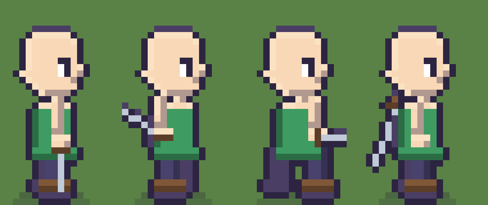
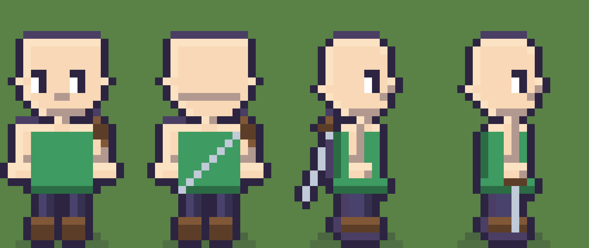

# Estudo de animacao: caminhada, combate e armas

Companheiro do `docs/estudo-de-sprites.md`. Aquele olha para o **desenho** de um
quadro; este olha para o **movimento** entre eles, e para todos os bonecos, nao
so o heroi.

Como o outro, e um estudo. Nada aqui foi implementado.

---

## 1. O inventario: tudo que se anima hoje

97 PNG em `public/assets`, dos quais **62 sao folhas de personagem** com a mesma
grade: 6 colunas por 8 linhas, 48 quadros de 16 x 32.

| o que | folhas | de onde vem |
|---|---|---|
| corpo do heroi | 15 | 5 racas x 3 tons de pele |
| bracos do heroi | 15 | idem, camada separada |
| cabelo | 7 | um por corte |
| chapeu | 6 | um por tipo |
| NPCs achatados | 10 | `NPCS` em `arte/gente.py` |
| goblins | 5 | 4 tipos, mais o generico |
| aranhas | 4 | filhote, pequena, media, matriarca |
| roupas | 21 | 5 estilos x 3 tipos de corpo, grade propria de 4 x 3 |
| armas | 5 | peca unica, com ponto de pega |

**Sao 48 quadros por folha, mas so 4 desenhos diferentes.** `normalizar()` em
`arte/base.py` transforma as oito direcoes em quatro vistas mais um giro, entao
as quatro linhas diagonais sao as verticais com o rosto virado. Isso e uma
decisao boa e ela fica: o custo de oito vistas de verdade a 16 px nao se paga.

---

## 2. O que as seis colunas cobrem, e o que nao existe

As colunas sao `parado, passo-a, passo-b, respira, conjura, tonto`
(`COLUNAS` em `arte/base.py`, `QUADRO` em `src/dados/config.ts`).

| animacao | quadros | onde |
|---|---|---|
| caminhar | passo-a, parado, passo-b, parado, a 5 fps | `CICLO_CAMINHADA` |
| parado | parado 2200 ms, respira 700 ms | `heroi.ts` |
| conjurar | conjura, quadro unico, 700 ms | `conjurar()` |
| levar susto | tonto, quadro unico, 900 ms | `ficarTonto()` |

**Correcao de 2026-09-06: a tabela acima e a frase abaixo sao de antes do
combate por turnos entrar no jogo de verdade.** `ataque`, `machucado`,
`esquiva`, `fuga` e `derrota` ja existem desenhados (`arte/pessoa.py`) e
ligados em animacao Phaser real (`heroi.ts`, ex. `${chave}-ataque-${dir}`).
So falta o `telegrafo` de verdade citado no proximo paragrafo - nao "nenhum
quadro de combate".

Nao existe **telegrafo** de verdade. Nem correr, nem sacar a arma.

Isso nao e um detalhe estetico: e um contrato quebrado com
`docs/modelo-de-combate.md`, que ja decidiu coisas que exigem quadros que a arte
nao tem.

| o modelo de combate pede | quadro que existe hoje |
|---|---|
| "telegrafo de meio segundo antes de todo golpe" | nenhum |
| "o heroi executa o quadro de conjuracao" | `conjura` — este existe |
| "o ataque basico nao rola. Bater sempre funciona" | nenhum |
| "zero coracoes e derrota: o heroi cai" | `tonto`, que e outra coisa |
| "a criatura responde" | nenhum |

`tonto` foi desenhado para susto, nao para derrota, e o comentario em
`arte/pessoa.py` diz isso: olhos em X e a cabeca 1 px mais baixa. Um heroi
derrotado nao fica tonto em pe: ele **cai**. Sao poses diferentes e as duas
precisam existir.

---

## 3. Os defeitos que atravessam TODOS os bonecos

Este e o achado mais util do estudo, e ele e de arquitetura, nao de desenho.

**`deslocamento()` em `arte/base.py` e uma funcao so, e heroi, goblin e aranha
chamam as tres.** Os defeitos de animacao nao estao espalhados por cinco
arquivos: estao num lugar, e reaparecem em cada bicho porque cada bicho le a
mesma tabela.

```python
def deslocamento(coluna):
    """(balanco da perna, sobe e desce do corpo, balanco do braco)."""
    if coluna == "passo-a":  return 1, -1, 1
    if coluna == "passo-b":  return -1, -1, -1
    if coluna == "respira":  return 0, 1, 0
    return 0, 0, 0
```

Quatro coisas erradas nessas cinco linhas, e as quatro valem para o heroi, para
as 5 racas, para os 10 NPCs, para os 4 goblins e para as 4 aranhas:

**3.1 O balanco da perna entra na ALTURA.** Quem chama faz
`perna_alt + bal` — o heroi em `pessoa.py`, o goblin em `goblin.py`, o mesmo
erro copiado. A perna cresce e encolhe 1 px em vez de avancar. Nao e um passo.

**3.2 O bob esta na fase errada.** Os dois quadros de passo sobem o mesmo 1 px.
Quando as pernas se abrem o quadril **desce**, nao sobe. E como os dois sao
iguais, o corpo faz um tremor de amplitude 1 em vez de um balanco.

**3.3 O braco balanca em Y.** Quem chama faz `ombro_y - balanco` (heroi) ou
`tronco_topo + 1 + bal` (goblin): o ombro sobe e desce. Isso esta certo de
frente, onde o balanco do braco vai na direcao da camera e so 1 px sobra para
ver. **De perfil esta errado**: de lado o braco vai para a frente e para tras,
no eixo do movimento. Hoje ele nunca faz isso, em nenhum bicho.

**3.4 O perfil e a frente.** Detalhado no outro estudo. Vale igual para o
goblin: `px_esq` e `px_dir` em `goblin.py` tambem ignoram `direcao`.

**3.5 Nao ha maos.** So no heroi.

### O goblin ja acerta duas coisas que o heroi erra

Vale registrar, porque a solucao ja esta escrita no repositorio:

```python
# arte/goblin.py, nas orelhas E nos bracos
if direcao == "esquerda" and lado > 0:
    continue
if direcao == "direita" and lado < 0:
    continue
```

O goblin **esconde a orelha e o braco do lado de tras quando esta de perfil**. O
heroi desenha os dois, e e por isso que o rosto dele de lado parece torcido.
Copiar isso para `pessoa.py` sao quatro linhas.

E o braco do goblin ja termina com uma linha em `GOBLIN_C`, um tom mais claro:
e uma mao embrionaria. A regra da mao do outro estudo (pulso em sombra, mao 1 px
mais larga) e a versao acabada disso.

### A aranha esta certa, e por outro motivo

`arte/aranha.py` nao usa `perna_bal` nem `braco_bal`: ela tem ciclo proprio.

```python
fase = 1 if (grupo == 1 and impar) or (grupo == 2 and not impar) else 0
```

Dois grupos de pernas alternando, e o pe do grupo no ar sobe 2 px e recua. **E
como aranha anda de verdade**, e e a unica caminhada do jogo que hoje esta
certa. Nada nesta secao a afeta.

---

## 4. O braco na caminhada

Tres regras, e nenhuma delas existe hoje.

**O braco vai ao contrario da perna do mesmo lado.** Perna da frente avanca,
braco daquele lado recua. E o que separa "andar" de "marchar como boneco de
corda".

Hoje isso nao esta nem errado nem certo: **nao da para expressar.** `perna_bal`
vira comprimento de perna e `braco_bal` vira altura de ombro, e nenhum dos dois
tem eixo frente-e-tras. Nao existe oposicao a acertar porque nao existe o eixo
em que ela aconteceria. E por isso que a tabela abaixo troca os dois por
posicao, e nao so inverte um sinal.

**De perfil o balanco e em X; de frente e em Y.** De frente o braco balanca na
direcao da camera e so 1 px de sobe-e-desce sobra para ver — o que hoje se faz
esta certo *nessa vista*. De perfil o mesmo 1 px em Y nao le nada, e o que
precisa acontecer e o braco andar 1 px para frente e 1 para tras.

**O braco de tras so espia.** De perfil, 1 px atras do tronco, e so quando esta
balancando para tras. Desenhado inteiro ele vira uma coluna escura nas costas e
a 16 px isso le como mochila, nao como braco.

A tabela proposta, que substitui `deslocamento()`:

O `bob` segue a convencao que ja existe em `deslocamento()`: ele e somado ao y,
entao **positivo e para baixo**.

| coluna | perna perto | perna longe | bob | braco X | braco Y |
|---|---|---|---|---|---|
| parado | 0 | -1 | 0 | 0 | 0 |
| passo-a | +2 | -3 | **+1** | +1 | 0 |
| passo-b | -3 | +2 | **+1** | -1 | 0 |
| respira | 0 | -1 | +1 | 0 | 0 |

O `parado` do meio do ciclo e o quadro de **passagem**: pernas juntas, corpo no
ponto mais alto, e por isso `bob` 0. Os dois de passo sao os de **contato**:
pernas abertas, corpo 1 px mais baixo.

Repare que a conta e a mesma de hoje com o sinal trocado — hoje os passos sobem
1 px, aqui eles descem. E o `parado` fica quieto em 0 de proposito: ele e a pose
de parar tambem, e uma pose de parar nao pode flutuar 1 px acima do chao.

---

## 5. As armas: guardar, sacar, usar

Hoje a arma tem **um estado so**: na mao, sempre, em todo quadro. O padeiro nao
carrega arma e o cavaleiro nunca larga a espada, nem dormindo.

### Tres estados

| estado | quando | onde a arma esta |
|---|---|---|
| **guardada** | andando pela vila, explorando, falando | nas costas ou no cinto |
| **em punho** | com o modo de alvo aberto, ou perto de criatura | na mao, como hoje |
| **em uso** | nos quadros de golpe e de conjuracao | na mao, apontada |

Sacar e guardar sao a mesma transicao ao contrario, e ela precisa de **um quadro
so**: a mao subindo ate o ombro. O resto e a arma trocando de ponto de encaixe.

### Onde cada arma fica guardada

Isto nao e enfeite. **A silhueta passa a dizer a classe antes do rosto**, que e
o principio de legibilidade do `CLAUDE.md` aplicado ao personagem em vez de ao
cenario. De longe, na floresta, da para saber quem esta vindo.

| arma | classe | guardada em | por que |
|---|---|---|---|
| espada | cavaleiro | costas, diagonal | a silhueta mais reconhecivel das cinco |
| martelo | ferreiro | costas, cabeca para cima | pesado, o peso fica em cima |
| arco | cacador | costas, diagonal contraria | nao se confunde com a espada de longe |
| cajado | mago | **na mao, sempre** | mago nao guarda o cajado, ele se apoia nele |
| funda | amigo | cinto, no quadril | pequena demais para as costas ler |

O cajado ficar sempre na mao nao e excecao preguicosa: e caracterizacao, e sai
de graca porque e o comportamento de hoje.

### O ponto de encaixe novo: `costas`

A maquinaria ja existe e nao muda. `pontos_da_raca()` em `arte/pessoa.py` hoje
publica `mao`, `maoFraca`, `tronco` e `cabeca`. Ganha um quinto: `costas`, no
alto do tronco. `encaixes.json` cresce uma chave, e `heroi.ts` pendura a arma
la em vez de na mao quando o estado for `guardada`.

Cada arma ganha um segundo desenho, `guardada`, porque uma espada de perfil na
diagonal nao e a mesma espada em pe girada — em pixel art a 16 px nao se gira
nada sem virar sujeira.

### A ordem de desenho inverte

Esta e a parte bonita, e ela sai de graca.

| vista | as costas estao | o que se ve | a arma vai |
|---|---|---|---|
| de frente | longe da camera | so o punho, na altura do ombro | **atras** do corpo |
| de costas | na camera | a arma inteira, na diagonal | **na frente** do corpo |
| de perfil | de lado | punho acima do ombro, ponta abaixo do quadril | **atras** do corpo |

**E o contrario da regra `atras` que `arte/equipamento.py` usa hoje** para a arma
na mao, e tem que ser: a mao e as costas moram em lados opostos do corpo. Uma
arma guardada e uma arma na mao nunca podem usar a mesma regra de profundidade.

Um detalhe que o esboco ensinou: **o punho fica na altura do ombro, nunca acima
dele.** Num quadro de 16 x 32 a cabeca ocupa 10 das 16 colunas; nao sobra ceu
para um punho espiando por cima. Ao lado do ombro, sim.

---

## 6. Os quadros de combate que faltam

Proposta: de 6 para 12 colunas.

```
 0 parado     1 passo-a    2 passo-b    3 respira
 4 conjura    5 tonto      6 prepara    7 golpe
 8 recolhe    9 dano      10 caido     11 saca
```

| coluna | quem usa | o que e |
|---|---|---|
| `prepara` | heroi e criatura | **o telegrafo.** Meio segundo de arma armada para tras |
| `golpe` | heroi e criatura | o braco estendido, a arma onde a area de impacto vai |
| `recolhe` | heroi | o quadro de volta, que impede o golpe de piscar |
| `dano` | todos | recua 1 px, cabeca joga para tras |
| `caido` | heroi e criatura | derrotado no chao. **Nao e o `tonto`** |
| `saca` | heroi | a mao no ombro. Serve para sacar e para guardar |

`prepara` e o quadro que o modelo de combate exige por escrito e que a arte nao
tem. Sem ele nao existe telegrafo, e sem telegrafo o combate vira reflexo, que e
justamente o que aquele documento decidiu que o jogo nao e.

### Por que 12 colunas custam pouco

Porque quase nada e desenhado por quadro. Cabelo, chapeu, roupa e arma **seguem
por ponto de encaixe**: eles nao sabem o que e um golpe, so perguntam onde esta
a cabeca, o tronco e a mao naquele quadro. Uma coluna nova custa:

- uma pose nova em `pessoa.corpo()` e `pessoa.bracos()` — o trabalho de verdade;
- uma linha em `deslocamento()`;
- **zero** em cabelo, chapeu e roupa;
- uma linha em `LINHA_DA_ROUPA` para dizer qual das 3 linhas de roupa usar.

A folha vai de 96 x 256 para 192 x 256. Isso e 12 KB a mais por folha, vezes 62
folhas. Irrelevante.

### O telegrafo de cada bicho e diferente

E deve ser, porque e assim que o jogador aprende o bestiario.

| bicho | telegrafo |
|---|---|
| heroi | a arma arma para tras, o tronco inclina |
| goblin | o braco comprido sobe. Ele ja passa do joelho: subir le de longe |
| aranha | o corpo **abaixa** e as oito pernas encolhem, antes de dar o bote |

A aranha nao pode usar o telegrafo do goblin porque ela nao tem braco. E ela ja
tem meio caminho andado: a coluna `conjura` dela desenha um fio de teia subindo.
Isso ja e um telegrafo, so esta na coluna errada.

---

## 7. Os esbocos

`ferramentas/esbocar-sprites.py` desenha tudo que este documento propoe:

```bash
python3 ferramentas/esbocar-sprites.py
```

Os quadros de combate, de perfil. Parado, prepara, golpe, e a arma guardada:



Repare que o `prepara` arma para **tras e para baixo**, nao por cima da cabeca.
Foi uma tentativa: a lamina erguida passa por dentro do rosto num quadro de
16 px e o telegrafo deixa de ler. Para tras ela fica sozinha contra o fundo, que
e exatamente o que um telegrafo precisa.

A mesma espada guardada, de frente, de costas, de perfil, e em punho:



De frente so o punho aparece. De costas a arma inteira. **E a mesma peca no
mesmo ponto de encaixe**: o que muda e a ordem de desenho e quanto do corpo
tapa.

---

## 8. Ordem sugerida

1. **Trocar `deslocamento()` pela tabela da secao 4.** Uma funcao, e a caminhada
   de heroi, NPCs e goblins muda junto. Nada de novo desenho: so a leitura dos
   numeros muda de "altura" para "posicao".
2. **As maos, em `bracos()`.** Quatro vistas de uma vez, e e o que faz uma arma
   segurada parecer segurada.
3. **Esconder orelha e braco de tras no perfil**, copiando as quatro linhas do
   goblin.
4. **O perfil de verdade**, secao 4.2 do `docs/estudo-de-sprites.md`.
5. **`prepara`, `golpe`, `recolhe`.** Ate aqui nada de combate existe em codigo,
   entao estes tres quadros sao arte na frente do sistema. Vale: `prepara` e a
   peca que o modelo de combate ja decidiu e ninguem desenhou.
6. **`dano`, `caido`, `saca`**, junto da fase do roadmap que trouxer coracoes e
   derrota.
7. **A arma guardada.** A que mais muda a cara do jogo por linha escrita, e a
   unica deste documento que nao depende de nenhuma outra.

Cada passo pede `npm run arte`, `npm run conferir`, `npm run folha`, e olhar
`ferramentas/telas/personagens.png`. Um braco novo desencaixa alguma arma em
alguma das 25 combinacoes, e a folha e onde isso aparece.

---

## 9. O que este estudo nao resolveu

- **`docs/11-combate-e-magias.md` nao existe nesta branch.** O
  `docs/modelo-de-combate.md` cita a secao 15 dele, "a lista do que a arte vai
  precisar", que e exatamente o assunto deste documento. Quem juntar as duas
  frentes precisa reconciliar as duas listas antes de desenhar.
- **Correr.** O Stardew tem um ciclo de corrida proprio, de 8 quadros com tempos
  desiguais. Nao esta no roadmap e nao inventei coluna para isso.
- **A segunda mao.** `maoFraca` ja existe em `encaixes.json` e nada a usa.
  Escudo, tocha e arma de duas maos moram ai, e nenhum dos tres esta decidido.
- **Quantos quadros o golpe merece.** Propus tres (`prepara`, `golpe`,
  `recolhe`). Pode ser que dois bastem, ou que o `golpe` precise de dois. Isso
  so se sabe vendo rodar a 5 fps, e nao da para decidir num documento.
