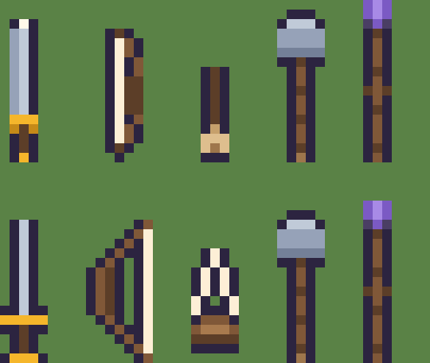
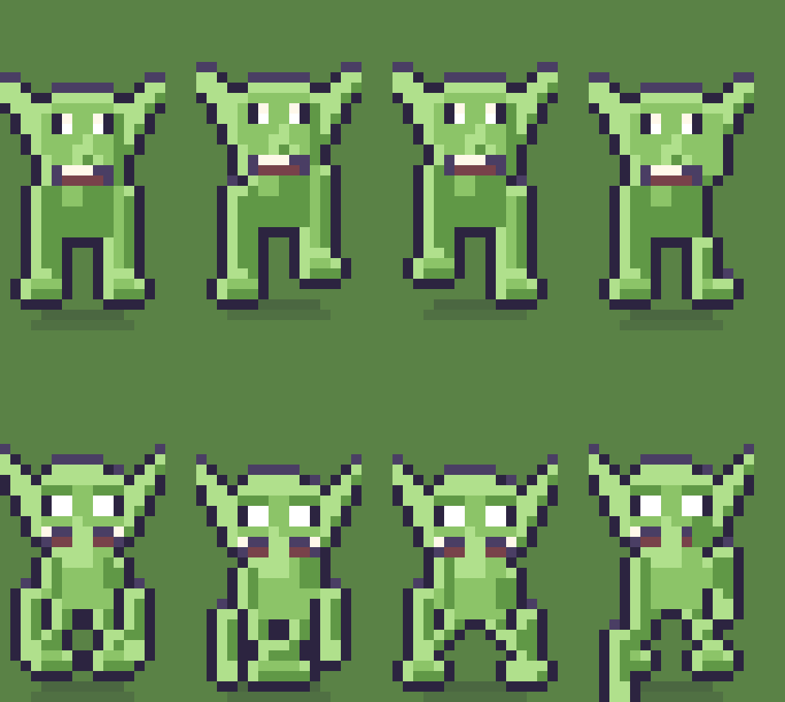

# Estudo: armas, monstros, visao, e como isto e documentado

Terceiro da serie, junto com `docs/estudo-de-sprites.md` (o desenho de um
quadro) e `docs/estudo-de-animacao.md` (o movimento entre eles). Este trata do
que sobrou: as armas, os bichos, os tres niveis de visao, e a pergunta de fundo
— **onde mora o contrato que diz como um sprite deste jogo e feito**.

Como os outros, e um estudo. Nada foi implementado.

---

## 0. Antes de qualquer coisa: uma decisao esta em aberto e trava tudo

`docs/09-plano-de-resolucao-e-contraste.md` ja recomendou, por escrito,
**dobrar a arte para 32 x 64** (opcao B da secao "Escolha 1"). O argumento dele
e bom: 16 x 32 da 4 px uteis de largura para um rosto, e por isso todo
personagem tem a mesma cara.

**Os tres estudos de sprite, incluindo este, assumem 16 x 32.** Os dois nao
podem estar certos ao mesmo tempo.

Isso nao e um detalhe a resolver depois. Se a arte vai dobrar, redesenhar a
espada em 5 x 15 agora e trabalho jogado fora; se nao vai, o `docs/09` precisa
dizer que a opcao B foi recusada e por que. **A decisao vem antes de qualquer
linha das secoes 3 e 4.**

Meu palpite, e e so um palpite: as correcoes de *estrutura* (perna que anda em
vez de esticar, perfil que e perfil, mao, arma guardada) valem em qualquer
resolucao e podem comecar hoje. As de *silhueta de arma* e *organicidade de
bicho* deviam esperar a decisao, porque sao exatamente o que muda de figura com
o dobro de espaco.

---

## 1. Onde mora o contrato hoje, e o buraco

### O documento existe e esta desatualizado

`docs/08-guia-de-sprites.md` e o lugar certo: ele ja tem as referencias, a
tecnica e a grade. Mas ele diz, na secao "Como e a nossa folha":

> Cada folha de personagem tem **6 colunas por 4 linhas**

**Sao 8 linhas desde que as diagonais entraram.** O documento descreve um jogo
que nao existe mais. Isso e o sintoma, nao o problema: o problema e que nenhum
processo obriga o guia a acompanhar o codigo. `npm run verificar` confere
paleta, listas, falas e PNG solto — nao confere documento.

### "Todos os NPCs usam a mesma tecnologia" nao e verdade hoje

Vale medir em vez de opinar. Cada linha e um bicho do jogo; cada coluna, uma
peca da tecnologia que o heroi usa.

| | camadas em runtime | ponto de encaixe | 8 direcoes | perfil proprio | mao | quadros de combate |
|---|---|---|---|---|---|---|
| heroi | **sim** | **sim** | sim | nao | nao | nao |
| NPC | nao, achatado | so na geracao | sim | nao | nao | nao |
| goblin | nao | nao | sim | parcial | quase | nao |
| aranha | nao | nao | sim | n/a | n/a | nao |

**O heroi e o unico que usa a tecnologia inteira.** O NPC usa metade: ele e
montado com as mesmas pecas em `npc_pronto()` (`arte/gente.py`), mas achatado
numa folha so na hora de gerar. Goblin e aranha nao usam nada dela — sao funcoes
de desenho monoliticas.

O "parcial" do goblin e elogio: ele ja esconde a orelha e o braco de tras no
perfil, coisa que o heroi nao faz. O "quase" da mao tambem: o braco dele ja
termina numa linha de `GOBLIN_C`.

### O que o achatamento do NPC custa

Nao e teorico. Sao tres coisas concretas:

1. **Toda correcao de anatomia precisa ser re-assada em 10 folhas.** Mao, perfil,
   passo: o heroi ganha na hora, o NPC so na proxima `npm run arte`. Ate ai,
   tudo bem — mas significa que nenhum NPC pode divergir do heroi nem de
   proposito.
2. **NPC nao troca de roupa em tempo de execucao.** Hoje isso nao faz falta.
   Faria, no dia em que um NPC precisar vestir outra coisa depois de um evento
   da historia, e o roteiro tem eventos assim.
3. **A arma do NPC e cola.** Ela ja foi carimbada no pixel. A proposta de arma
   guardada do `docs/estudo-de-animacao.md` nao alcanca NPC nenhum sem re-assar.

O achatamento **nao e erro**: o comentario em `gente.py` explica que NPC nao
troca de roupa em runtime, e e verdade hoje. E uma troca consciente de
flexibilidade por simplicidade. O que falta e isso estar escrito como decisao,
com a condicao que a derrubaria.

### A proposta

**`docs/08-guia-de-sprites.md` passa a ser o contrato**, e nao um guia de estilo.
Ele ganha:

- a tabela acima, mantida atualizada, dizendo quem implementa o que;
- a grade certa (6 x 8, e 12 x 8 se as colunas de combate entrarem);
- para cada peca da tecnologia, **a condicao que obriga a adotar**. Exemplo:
  "NPC pode ficar achatado enquanto nenhum NPC trocar de roupa por evento de
  historia. No dia em que isso acontecer, ele vira camadas."

E os tres estudos (`estudo-de-sprites`, `estudo-de-animacao`, este) **morrem
quando forem executados**, virando linhas do `08`. Estudo e andaime, nao
arquivo. Se daqui a seis meses os tres ainda estiverem aqui, e sinal de que
viraram documentacao paralela — que e exatamente o problema que o `docs/09` ja
tem com o `docs/11`.

---

## 2. O orcamento de leitura: os tres niveis de visao

### Como funciona

Nao ha zoom de camera. `src/sistemas/visao.ts` mantem a camera em 1 e troca a
**resolucao logica**; `src/main.ts` usa `Phaser.Scale.NONE` e um zoom inteiro
calculado a mao.

| nivel | canvas | em tiles |
|---|---|---|
| perto | 256 x 160 | 16 x 10 |
| normal | 320 x 192 | 20 x 12 |
| longe | 400 x 240 | 25 x 15 |

**O sprite nunca perde resolucao.** Ele e sempre 16 x 32 pixels logicos; o que
muda e quantos pixels de tela cada pixel logico ocupa. Isso e uma decisao boa e
ela fica.

### A escala que cada aparelho realmente recebe

`escalaInteira()` faz `floor(min(largura/logica, altura/logica))`, com uma
saida: se der menos que 1, usa o numero quebrado.

| aparelho | perto | normal | longe |
|---|---|---|---|
| iPhone deitado (852 x 393) | 2 | 2 | **1** |
| iPhone em pe (393 x 852) | 1 | 1 | **0,98** |
| iPad deitado (1194 x 834) | 4 | 3 | 2 |
| iPad em pe (834 x 1194) | 3 | 2 | 2 |
| desktop (1440 x 900) | 5 | 4 | 3 |

Tres problemas caem dessa tabela, e os tres sao de celular — o aparelho que o
`CLAUDE.md` poe em primeiro lugar junto com o iPad.

**2.1 No iPhone em pe, LONGE roda em escala 0,98.** Escala quebrada e
exatamente o que o comentario de `Mundo.ts` diz que nao pode acontecer: "com
zoom fracionario a grade de pixels sai do lugar e o mapa pisca ao andar". O
`>= 1 ? inteira : cabe` foi escrito para o caso em que nada cabe, e LONGE em
retrato cai nele por 2%.

**2.2 No celular, dois dos tres niveis dao o mesmo resultado.** Em pe, perto e
normal dao escala 1. Deitado, perto e normal dao 2. O jogador troca a
preferencia, ve mudar o campo de visao, e a nitidez nao muda — mas ele tambem
nao ganha o que o menu promete.

**2.3 Em escala 1 o heroi tem 16 x 32 pixels de tela.** Uns 4 mm de altura num
celular. Nenhum detalhe deste estudo sobrevive: nem a mao de 3 px, nem o nariz
do goblin, nem a guarda da espada.

### O orcamento, por escala

E daqui que sai a regra para as secoes 3 e 4.

| escala | 1 px logico vira | o que ainda le |
|---|---|---|
| 4 e 5 (iPad perto, desktop) | 4 a 5 px | tudo, ate o cilio de 1 px |
| 3 (iPad normal, desktop longe) | 3 px | silhueta, mao, guarda, nariz |
| 2 (iPad longe, iPhone deitado) | 2 px | **so silhueta e tom.** Detalhe de 1 px vira ruido |
| 1 e menos (iPhone) | 1 px | nada. Nem silhueta de 3 px |

**A regra:** todo detalhe que precisa ser lido em LONGE tem que caber em 2 px e
aparecer na **silhueta ou no tom**, nunca so na cor interna. Detalhe de 1 px
dentro do desenho e luxo de PERTO, e nao pode carregar informacao de jogo.

Isso condena por antecipacao qualquer solucao do tipo "o cavaleiro se distingue
pela cor da tunica": a 2 px de escala, cor interna some antes de silhueta.

### O que fazer com o celular

Nao resolvo aqui, mas as opcoes sao tres e vale registrar:

- **cortar LONGE no celular**, deixando so perto e normal. Honesto e barato.
- **niveis proprios por aparelho**, com larguras que dao escala inteira em
  telas de celular. Muda `ZOOM` de constante para funcao da tela.
- **aceitar escala quebrada em LONGE** e desistir da grade nesse caso so. E a
  pior das tres, e e a que esta valendo hoje sem ninguem ter escolhido.

---

## 3. As armas

### O diagnostico

As cinco armas, medidas: espada 3 x 15, cajado 3 x 17, arco 5 x 14, martelo
5 x 16, funda 3 x 10.

**Tres das cinco sao barras verticais.** E duas leem, tres nao — e da para dizer
exatamente por que:

| arma | le? | por que |
|---|---|---|
| martelo | **sim** | a cabeca de 5 px quebra a silhueta |
| cajado | **sim** | o cristal quebra a silhueta |
| espada | nao | a guarda tem a mesma largura da lamina: e um retangulo |
| arco | nao | **e uma linha reta. Nao existe arco reto** |
| funda | nao | um cabo com uma mancha bege na ponta |

A regra que sai disso: **arma se identifica pela silhueta, e silhueta precisa
de largura em algum lugar.** Uma barra de 3 px e a mesma barra de 3 px, seja
espada, cajado ou funda — e pela secao 2, em LONGE e so isso que sobra.

Isso importa mais do que parece porque o `docs/estudo-de-animacao.md` propoe a
arma guardada nas costas justamente para **a silhueta dizer a classe antes do
rosto**. Uma arma que nao tem silhueta propria nao consegue fazer esse trabalho.

### A proposta

Martelo e cajado ficam como estao: o que nao esta quebrado nao entra na lista.

- **espada**, 5 x 15: guarda de 5 px e macaneta. A cruz e o unico desenho que
  ninguem confunde com um cajado.
- **arco**, 7 x 15: curvo, com a corda esticada entre as pontas. A curva e a arma
  inteira; sem ela ha um graveto com uma fita clara colada.
- **funda**, 5 x 12: duas cordas e uma bolsa de couro. Um Y, nao um pauzinho.

Todas as tres passam no teste de 2 px: a cruz da espada, o arco da corda e o Y
da funda sobrevivem em silhueta pura.

---

## 4. Os monstros

### O goblin: quatro retangulos do mesmo verde

O `arte/goblin.py` tem a melhor documentacao de intencao do repositorio — o
docstring lista postura curvada, nariz que sai da silhueta, perna arqueada. **O
desenho nao entrega quase nada disso.**

| a intencao, no docstring | o que o codigo faz |
|---|---|
| "postura curvada" | tronco retangular, `ret(corpo_x, tronco_topo, corpo_l, tronco_alt)` |
| "nariz comprido saindo da silhueta" | de frente, desenhado **dentro** do rosto, 1 tom acima. Some |
| "perna arqueada" | duas colunas retas de 2 px |
| "braco comprido" | retangulo de 2 px, no mesmo verde do tronco |

E o defeito de fundo: **cabeca, tronco, braco e perna sao o mesmo tom.** O que
separa um do outro e so o contorno. De longe o goblin e uma mancha verde com
duas orelhas.

Tres regras consertam isso, e nenhuma delas e "desenhar melhor":

1. **Tom separa membro.** Braco e perna em `GOBLIN_E`, tronco em `GOBLIN`, mao em
   `GOBLIN_C`. Sem isso o torso e os bracos sao uma mancha so. Pela secao 2,
   tom e a unica coisa alem da silhueta que sobrevive em LONGE.
2. **Nada de lado reto.** Cabeca em cunha, tronco em barril, perna arqueada.
   Organico a 16 px nao e curva suave: e cada linha ter largura diferente da de
   cima.
3. **O nariz tem que furar a silhueta.** Ele passa por cima da boca e a ponta
   sai da linha do queixo, com contorno em volta. Dentro do rosto, um tom acima,
   ele nao existe.

**O esboco convergiu na cabeca e nao convergiu no corpo.** O rosto proposto e
melhor sem discussao: craneo em cunha, olhos grandes, orelha com forma, e um
nariz que finalmente aparece de frente. O corpo esta so melhor: os bracos leem
como bracos, mas as pernas ficaram finas demais e a proporcao entre cabeca e
tronco pesou para a cabeca. Levei tres tentativas e parei — o corpo do goblin e
trabalho de execucao, nao de estudo, e as tres regras acima valem mesmo com o
esboco imperfeito.

### A aranha: o problema dela nao e animacao

Registro para nao mexer no que esta certo. `arte/aranha.py` tem **a unica
caminhada correta do jogo**: dois grupos de pernas alternando, com o pe do grupo
no ar subindo 2 px e recuando. Isso e como aranha anda, e nenhuma proposta destes
estudos a afeta.

O que ela tem e problema de **forma**:

- o corpo e uma lozango achatado que ocupa quase a largura toda do quadro, e o
  docstring pede "corpo redondo e peludo";
- os oito olhos viram uma faixa xadrez de branco e escuro no meio do corpo. A
  2 px de escala isso le como grade, nao como olhos. Pela secao 2: oito olhos de
  1 px sao oito pixels de ruido. **Quatro olhos maiores leriam melhor que oito
  pequenos**, e continuariam dizendo "aranha";
- as pernas arqueiam com o joelho acima do corpo, e o resultado le como espinhos
  em cima em vez de pernas em volta.

O telegrafo dela ja existe pela metade: a coluna `conjura` desenha um fio de
teia subindo. Esta na coluna errada, so isso.

---

## 5. Ordem sugerida

0. **Decidir 16 x 32 ou 32 x 64** (secao 0). Nada de silhueta comeca antes.
1. **Consertar a linha errada do `docs/08`** e promover ele a contrato, com a
   tabela da secao 1. Meia hora, e e o que impede o proximo estudo de nascer
   solto.
2. **Escolher o que fazer com LONGE no celular** (secao 2). E um bug de grade de
   pixels em producao, nao uma melhoria.
3. **As tres armas** (secao 3). Independentes de tudo, e a arma guardada do
   outro estudo depende delas para funcionar.
4. **As tres regras do goblin** (secao 4). Depois das correcoes estruturais do
   `docs/estudo-de-animacao.md`, porque o goblin herda `deslocamento()`.
5. **A forma da aranha**, sem tocar na caminhada dela.
6. **NPC em camadas**, so no dia em que um NPC precisar trocar de roupa.

---

## 6. O que este estudo nao resolveu

- **Se o achatamento do NPC deve acabar.** Levantei o custo; a decisao depende
  do roteiro, nao da arte.
- **Os niveis de visao no celular.** Apontei tres saidas e nao escolhi: a
  escolha muda a experiencia de toque, que e area do `docs/07-design-system.md`.
- ~~**O corpo do goblin.** Tres tentativas, convergiu so a cabeca.~~ **Resolvido
  em 2026-09-05:** `arte/goblin.py` foi reescrito em 48 x 96 (3x, so o goblin,
  decisao do Hugo — ver `docs/estudo-de-resolucao.md`), com tom separando
  tronco/membro/mao como este estudo pedia, nariz que fura a silhueta de
  frente, orelha em folha de verdade, tanga de couro e um porrete para o
  telegrafo de ataque. `src/cenas/Boot.ts`/`Mundo.ts`/`Combate.ts` compensam a
  escala para ele continuar do mesmo tamanho no mundo.
- **Os outros sete bichos do bestiario.** Quando este estudo comecou, so goblin
  e aranha existiam em arte. **Durante a sessao, outra frente desenhou os sete
  que faltavam** — `arte/lobo.py`, `serpente.py`, `espantalho.py`, `bruxa.py`,
  `cavaleiro.py`, `dragao.py` e `troll.py`, ainda nao commitados. Eles nao foram
  analisados aqui e as regras das secoes 4 e 5 nao foram aplicadas a eles. Quem
  continuar precisa olha-los com os mesmos olhos: tom que separa membro,
  silhueta que sobrevive a 2 px, e nada de lado reto.
