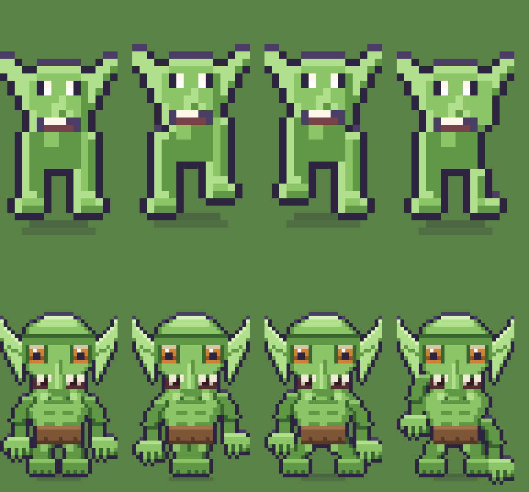

# Estudo: a resolucao da arte

Este documento responde a decisao que `docs/09-plano-de-resolucao-e-contraste.md`
deixou em aberto e que os tres estudos de sprite travaram: **a arte cresce, e
quanto.**

A resposta curta e sim, cresce. O resto e escolher o numero e saber o que ele
custa.

---

## 1. A confusao que precisa sair da frente primeiro

"Aumentar a resolucao" nao e "deixar o personagem maior na tela". Sao duas
coisas independentes, e misturar as duas e o que faz essa conversa andar em
circulo.

```
tamanho na tela  =  pixels da arte  x  escala
```

Hoje, num monitor de 1440 x 900: o personagem tem 16 x 32 pixels de arte, a
escala e 4, e ele ocupa **64 x 128 pixels de tela**.

| arte | escala | na tela | pixels para desenhar |
|---|---|---|---|
| 16 x 32 | 4 | 64 x 128 | 512 |
| 32 x 64 | 2 | 64 x 128 | 2.048 |
| 64 x 128 | 1 | 64 x 128 | 8.192 |

**As tres linhas dao personagens do mesmo tamanho na tela.** O que muda e
quantos pixels descrevem esse tamanho — 512, 2.048 ou 8.192 — e, portanto,
quao fino e o grao. Escolher resolucao e escolher **o tamanho do pixel**, nao o
tamanho do boneco.

E daqui que sai o custo: a arte cresce com a **area**. Dobrar o lado quadruplica
o trabalho de desenhar.

---

## 2. Agora que o alvo e o computador, a conta muda

Quando o celular estava na conta, ele mandava: `escalaInteira()` exige escala
inteira, e no iPhone em pe qualquer coisa acima de tile 32 cai em escala
quebrada — o proprio defeito que `Mundo.ts` diz que nao pode existir ("com zoom
fracionario a grade de pixels sai do lugar e o mapa pisca ao andar").

Com o computador na frente, some o teto. E aparece uma saida melhor que
escolher entre aparelhos:

**Em escala 1, o problema de escala inteira deixa de existir.** Escala 1 e
inteira em qualquer tela, de qualquer tamanho. O canvas passa a ser do tamanho
da janela e o que muda de aparelho para aparelho e **quantos tiles cabem**, nao
a nitidez.

| arte do tile | escala | tiles em 1440 x 900 | tiles no iPhone deitado | personagem na tela |
|---|---|---|---|---|
| 16 (hoje) | 4 | 22 x 14 | 26 x 12 (esc. 2) | 64 x 128 |
| 32 | 2 | 22 x 14 | 26 x 12 (esc. 1) | 64 x 128 |
| **48** | **1** | **30 x 18** | **17 x 8** | **48 x 96** |
| 64 | 1 | 22 x 14 | 13 x 6 | 64 x 128 |

As duas linhas de baixo rodam **em escala 1 no computador e no celular, com a
mesma arte**. Nenhuma delas precisa de segunda versao.

---

## 3. "Depois fazemos uma versao para celular" custa mais do que parece

Vale dizer com todas as letras, porque e a coisa mais cara deste documento se
passar batido.

**Duas resolucoes de pixel art sao dois conjuntos de funcoes de desenho.** Nao e
redimensionar: um contorno de 1 px continua sendo 1 px nas duas, uma sombra de
2 px continua sendo 2 px, e um olho que era 2 x 2 vira 5 x 6, nao 4 x 4. O
proprio `docs/09` ja tinha escrito isso na secao do custo da opcao B, e vale
igual aqui.

Na pratica, "versao para celular" significa manter `arte/pessoa.py`,
`arte/goblin.py`, `arte/mundo.py` e `arte/tiles.py` **em duas versoes que
divergem em toda mexida**. E o tipo de coisa que funciona por dois meses e
apodrece no terceiro.

**A alternativa e nao precisar de duas.** Se a arte roda em escala 1, o celular
nao pede arte propria: ele pede um **campo de visao** menor, que e configuracao,
nao desenho. E linha 3 ou 4 da tabela acima.

Se ainda assim a versao de celular for desejada depois, ela existe — mas ela e
uma decisao de gastar o dobro de arte, e nao um ajuste.

---

## 4. A recomendacao

**Tile 48, personagem 48 x 96, escala 1, canvas do tamanho da janela.**

Por que 48 e nao 32 nem 64:

- **contra 32:** 32 x 64 em escala 2 mantem o pixel visivelmente chunky. E
  bonito e e o estilo de hoje, so que maior — e o pedido foi tirar o aspecto
  infantil, nao ampliar ele. Alem disso 32 so roda no celular a escala 1
  forcando um canvas fixo, que e o problema que estamos saindo.
- **contra 64:** 64 x 128 e 16 vezes a area de hoje. E lindo e e um projeto
  diferente: significa reescrever dez arquivos de desenho com dezesseis vezes
  mais decisao por peca. Se o objetivo e ter um jogo jogavel, 64 e o caminho
  para nao terminar.
- **48** e 9 vezes a area de hoje, roda em escala 1 nos dois aparelhos com a
  mesma arte, e cabe tudo que o esboco da secao 5 provou caber ja em 4 vezes.

Duas consequencias que vem junto e nao sao negociaveis:

**A rampa de cor cresce de 3 para 5 tons por material.** Isso e metade do ganho,
e nao custa resolucao nenhuma — custa `arte/paleta.py`. Com 3 tons uma
superficie e clara ou escura; com 5 ela pode ser curva.

**Os tres niveis de visao viram dois.** Em escala 1 o canvas e a janela, entao
"perto" so existe como escala 2. E honesto: o `docs/estudo-de-bichos-e-armas.md`
ja mostrou que hoje os tres niveis colapsam em dois na maioria dos aparelhos —
o menu promete tres e entrega dois.

---

## 5. O que mais pixels compram, provado

Esbocei o goblin em 32 x 64 — **quatro vezes a area, nao nove**, para custar um
esboco e nao um projeto. Se 4x ja resolve o que esta na lista, 9x resolve com
folga.

`python3 ferramentas/esbocar-resolucao.py`



Em cima, o goblin de hoje ampliado 2x com vizinho mais proximo. Embaixo, o
esboco. **Os dois estao do mesmo tamanho fisico de proposito**: um nao e maior
que o outro, e o mesmo espaco na tela com quatro vezes mais pixels dentro.

Quatro coisas mudam, e nenhuma delas e "desenhar melhor". Sao coisas que
simplesmente **nao cabiam**:

**Rampa de 5 tons.** Com 3, o peitoral do goblin so pode ser claro ou escuro, e
o resultado e chapado. Com 5 ele tem luz, meio-tom, base, sombra e vinco, e o
torso passa a ter volume.

**Contorno interno.** O contorno de hoje so existe na borda de fora da silhueta.
No esboco, braco, cotovelo, coxa e mandibula tem linha propria **por dentro** do
desenho. Foi o que o pedido de "mais contorno" descreveu, e ele so existe com
espaco para uma linha que nao come o membro inteiro.

**Olho com estrutura.** A 16 px o olho e um retangulo branco com um pixel
escuro. A 32 cabem esclera, iris, pupila e brilho — e o goblin passa a **estar
olhando para alguma coisa**. Isso muda mais a impressao de vida do que qualquer
outra coisa da lista.

**Mao com dedos.** Tres dedos e um polegar, com vao escuro entre eles. A 16 px a
mao inteira teria 3 px de largura: nao ha dedo nenhum, e por isso o pedido de
"bracos mais definidos" nao tinha resposta na resolucao atual.

O esboco tem defeitos — a perna e o pe ficaram fracos e a proporcao pende para a
cabeca. Sao defeitos de execucao, nao de resolucao, e e justamente a diferenca
que importa: **a 16 px eles nao eram consertaveis; a 32 sao.**

---

## 6. O cenario: resolucao nao e o problema principal

Olhei o tileset (128 x 48, 24 tiles de 16) e os objetos.

**Os objetos ja estao maiores que um tile.** A casa grande tem 64 x 68, a arvore
40 x 52, a barraca 44 x 34. Eles nao estao presos a 16 px, e nao e resolucao que
os limita. O que os deixa simples e outra coisa:

- **a copa da arvore e um blob de 2 tons com um arco de luz.** Nao ha
  aglomerado de folha, nao ha galho aparecendo, nao ha buraco de ceu. Isso e
  falta de rampa, nao de pixel;
- **a casa e um retangulo e um triangulo.** Parede reta, sem beiral, sem
  espessura, sem sombra propria projetada no chao. Uma casa ganha muito mais com
  1 px de beiral e uma sombra projetada do que com o dobro de resolucao;
- **nada tem sombra projetada no chao** alem da elipse macia dos personagens.

**Os tiles sao o elo fraco, e o problema deles tem nome:**

- **sao ruido, nao textura.** Grama, terra, areia e pedra sao dithering
  aleatorio. Nao ha tufo de grama com direcao, nao ha forma de pedra, nao ha
  veio na terra. De longe le como chiado de TV;
- **nao existe tile de transicao.** A grama encontra a terra num corte reto de
  16 px. **Essa e a maior fonte isolada do aspecto "simples"**, e ela nao custa
  resolucao nenhuma: custa desenhar as bordas. Em qualquer resolucao, um mapa
  sem transicao parece um tabuleiro de xadrez.

Ou seja: para o cenario, a ordem certa e **transicao e rampa primeiro,
resolucao depois**. As duas primeiras melhoram o jogo hoje, em 16 px, e
continuam valendo quando a arte crescer.

---

## 7. O custo real, sem enfeite

Toda a arte e gerada por codigo, entao nao ha PNG para repintar a mao. Sao dez
arquivos, e este e o tamanho deles hoje:

| arquivo | linhas | o que muda |
|---|---|---|
| `arte/pessoa.py` | 428 | reescrita: corpo, esqueleto, encaixes |
| `arte/mundo.py` | 364 | reescrita: casa, arvore, poco |
| `arte/floresta.py` | 336 | reescrita |
| `arte/ui.py` | 277 | painel de 9 fatias e icones |
| `arte/tiles.py` | 263 | reescrita, e e onde entram as transicoes |
| `arte/gente.py` | 252 | ajuste, monta as pecas |
| `arte/cabelo.py` | 222 | reescrita |
| `arte/paleta.py` | 196 | **cresce de 3 para 5 tons por material** |
| `arte/goblin.py` | 185 | reescrita |
| `arte/equipamento.py` | 173 | reescrita |
| `arte/roupa.py` | 197 | reescrita |
| `arte/aranha.py` | 141 | reescrita |
| `arte/fonte.py` | 126 | a fonte tambem dobra |

Fora de `arte/`: `ALTURA_PERSONAGEM`, `ZOOM`, `escalaInteira()`, o design system
inteiro (`src/sistemas/design.ts` usa medidas em pixel logico), e os tres
verificadores (`verificar`, `auditar`, `conferir`) tem numeros embutidos.

**Nao e "multiplicar por 3".** Um contorno de 1 px continua sendo 1 px. Uma
sombra de 2 px continua sendo 2 px. Um olho que era 2 x 2 vira 5 x 6, nao 6 x 6.
Cada funcao precisa de decisao humana, e e por isso que 48 e a recomendacao e
64 nao e.

---

## 8. Ordem sugerida

1. **Decidir o numero.** Nada abaixo comeca antes. A recomendacao e 48.
2. **A rampa de 5 tons em `arte/paleta.py`.** Vale hoje, em 16 px, e e metade do
   ganho de qualidade. Independente de tudo.
3. **Tiles de transicao.** Tambem vale hoje, e e a maior melhora isolada do
   cenario por trabalho gasto.
4. **`escalaInteira()` e `ZOOM`**, para o modelo de escala 1 com canvas da
   janela. E codigo, nao arte, e destrava o resto.
5. **`arte/pessoa.py` e `arte/goblin.py`**, nessa ordem: o heroi e o bicho que o
   jogador mais olha. Aqui entram, ja na resolucao nova, as correcoes
   estruturais dos outros tres estudos — perfil, mao, passo, arma guardada.
   **Nao faca essas correcoes duas vezes**; se a resolucao vai mudar, elas
   nascem na resolucao nova.
6. O resto de `arte/`, em qualquer ordem.

---

## 9. O que este estudo nao resolveu

- ~~**O corpo do goblin.** O esboco convergiu no rosto, nas maos e no torso; a
  perna e o pe ficaram fracos. E execucao, e fica para quando for pra valer.~~
  **Executado em 2026-09-05**, e so ele: o Hugo decidiu ir direto para a
  resolucao maior (48, a recomendacao daqui) **so no goblin**, sem esperar a
  decisao de resolucao do resto do jogo (secao 8 continua em aberto para
  tudo mais). `arte/goblin.py` foi reescrito em 48 x 96, com perna arqueada e
  pe com dedos de verdade, resolvendo o que faltava. Como o resto do jogo
  continua em 16 x 32, isso exigiu uma escala de exibicao nova (o goblin tem
  3x mais pixel na arte mas o MESMO tamanho no mundo) — ver `escalaDoSprite()`
  em `src/dados/config.ts`, usada em `Boot.ts`, `Mundo.ts` e `Combate.ts`.
  Primeira vez que o jogo separa "pixels da arte" de "tamanho no mundo".
- **A fonte.** `arte/fonte.py` gera a fonte de bitmap. Ela dobra junto, e nao
  olhei o que isso faz com o design system.
- **Se o jogo continua sendo pixel art.** Em escala 1 e tile 48, num monitor
  retina, o pixel individual quase nao aparece. Isso e o pedido — "tirar o
  aspecto infantil" — mas e uma mudanca de identidade visual, nao so de numero.
  Vale olhar o esboco da secao 5 num monitor de verdade antes de fechar.
- **O que fazer com `docs/09`.** Ele recomendava a opcao B (32 x 64). Este
  documento recomenda 48. Um dos dois precisa ceder por escrito, e a regra do
  `CLAUDE.md` e que a divergencia vira decisao escrita, nao acidente.
