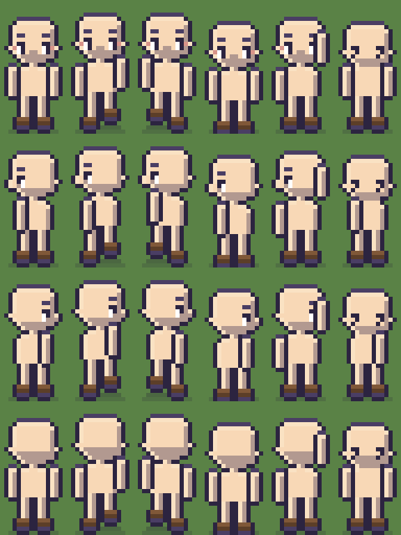
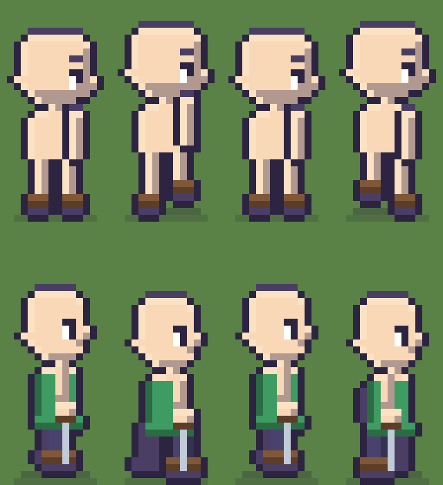
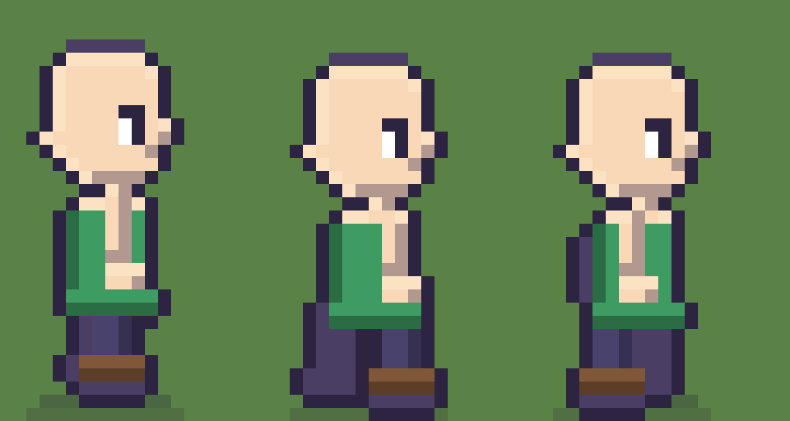
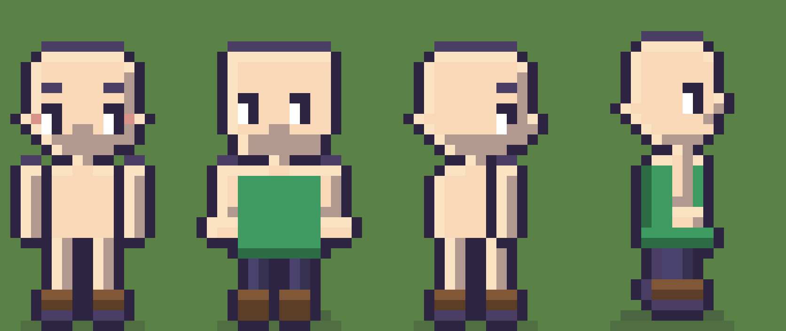

# Estudo dos sprites: por que o boneco esta estranho

Este documento e um **estudo**, nao uma decisao tomada. Ele olha para o que
existe hoje, olha para o que Stardew Valley e Project Zomboid fazem, e propoe o
que mudar. Nada aqui foi implementado ainda.

Sem numero de fase no nome, de proposito: ele atravessa varias fases do
`docs/05-roadmap.md` e nao pertence a nenhuma.

---

## 1. O diagnostico, em uma frase

**O sprite so tem uma vista de verdade, a de frente, e as outras tres sao a de
frente com o rosto trocado.**

Tudo que incomoda sai disso. O perfil nao parece perfil porque o corpo dele e o
corpo de frente. A caminhada nao parece caminhada porque as pernas nao andam,
elas esticam. A arma parece trocar de mao porque nao existe um lado do corpo:
existe "o lado para onde ele esta olhando".

Aqui esta a folha do heroi como ela sai hoje, nas quatro vistas
(`public/assets/heroi-corpo-vale-0.png` + `heroi-bracos-vale-0.png`):



Linha 1 de frente, linha 2 para a esquerda, linha 3 para a direita, linha 4 de
costas. Cubra a cabeca com o dedo e as quatro linhas viram o mesmo desenho.

---

## 2. Os cinco defeitos, com o codigo que os causa

### 2.1 De perfil o corpo continua de frente

Em [`arte/pessoa.py`](../arte/pessoa.py), `corpo()` desenha o tronco com a mesma
largura em qualquer direcao:

```python
tr_l = c["tronco"]          # 8 px, sempre
tr_x = _lados(tr_l)         # centrado, sempre
```

Um corpo humano de perfil e mais **fino** que de frente: os ombros somem, o
peito vira uma faixa estreita. Mantendo 8 px em todas as vistas, a silhueta de
perfil e identica a de frente, e a unica coisa que diz "de lado" e um olho a
menos.

Junto com isso, as duas orelhas continuam sendo desenhadas de perfil:

```python
if direcao != "cima":       # <- nao exclui esquerda nem direita
    ...
    pontos(im, [(cab_x - 1, oy + 1), (cab_x + cab_l, oy + 1)], pele)
```

De perfil so existe **uma** orelha. A segunda, do outro lado da cabeca, e o que
faz o rosto parecer torcido.

### 2.2 As pernas ficam lado a lado de perfil

Este e o defeito que voce apontou, e ele esta explicito no codigo. Os dois x das
pernas sao constantes, sem olhar para `direcao`:

```python
px_esq = 8 - vao // 2 - pe_l
px_dir = 8 + vao // 2
```

De perfil, uma perna esta **atras da outra**, nao ao lado. As duas ocupam a
mesma faixa de x quando estao juntas, e a de tras se distingue por estar em tom
de sombra, nao por estar deslocada horizontalmente.

Os pes tem o mesmo problema: sao desenhados simetricos, apontando para a tela,
em qualquer direcao. De perfil o pe aponta para onde o personagem anda, e fica
**comprido em x**.

### 2.3 O passo estica a perna em vez de dar um passo

Em [`arte/base.py`](../arte/base.py), `deslocamento()` devolve o balanco da
perna, e em `corpo()` ele e usado assim:

```python
ret(im, x, pe_topo, pe_l, alt + bal, pele)   # <- altura + bal
```

O `bal` entra na **altura** da perna. Uma perna fica 1 px mais comprida e a
outra 1 px mais curta. Isso nao e um passo: e uma perna crescendo. Um passo
move a perna no **eixo do movimento**, e as duas se afastam e se cruzam.

### 2.4 O sobe-e-desce do corpo esta na fase errada

Ainda em `deslocamento()`:

```python
if coluna == "passo-a":
    return 1, -1, 1     # pernas abertas, corpo SOBE 1 px
if coluna == "passo-b":
    return -1, -1, -1   # pernas abertas, corpo SOBE 1 px
```

Nos dois quadros de passo o corpo sobe o mesmo 1 px. Duas consequencias:

- **Nao ha bob.** Se os dois quadros de passo tem o mesmo `sobe`, e o ciclo e
  `[passo-a, parado, passo-b, parado]`, o corpo faz sobe-desce-sobe-desce com
  amplitude 1 e frequencia dobrada. Nao e o balanco de um andar, e um tremor.
- **A fase esta invertida.** Quando as pernas se abrem, o quadril **desce**: o
  triangulo formado pelas pernas fica mais largo e mais baixo. Quando as pernas
  passam uma pela outra, o corpo esta no ponto mais **alto**. Hoje e o
  contrario.

### 2.5 A arma troca de mao

Em `geometria()`, o braco que segura a arma muda de lado conforme a direcao:

```python
elif direcao == "esquerda":
    forte, fraco = (tr_x, ombro_y + balanco), None          # mao na ESQUERDA
elif direcao == "direita":
    forte, fraco = (tr_x + tr_l - 2, ombro_y - balanco), None  # mao na DIREITA
```

A mao "forte" e sempre a do lado para onde o personagem olha. Andando para a
esquerda a espada esta a esquerda do corpo; andando para a direita ela esta a
direita. Do ponto de vista do jogador, o heroi passou a espada de uma mao para
a outra no meio do caminho.

Isso acontece porque **esquerda e direita sao desenhadas separadamente**, como
duas vistas independentes, e nada garante que sejam a mesma pessoa vista de dois
lados.

---

## 3. O que os dois jogos de referencia fazem

### Stardew Valley

O fazendeiro e exatamente 16 x 32 px, o mesmo tamanho que o nosso, entao tudo
que ele resolve cabe no nosso quadro. Da wiki de modding:

**Camadas, de baixo para cima:** cabeca/tronco/botas, calca, camisa, acessorios,
cabelo, chapeu, **bracos por ultimo**. Nossa ordem em
[`src/sistemas/heroi.ts`](../src/sistemas/heroi.ts) ja e essa. Isso a gente
acertou.

**Os bracos sao uma camada com animacao propria**, e ocupam 12 colunas da folha
(o dobro do corpo e da calca, que tem 6 cada). O braco nao e um apendice do
corpo: e o que carrega a ferramenta, e por isso tem mais quadros que o resto.

**Esquerda e direita sao a mesma arte, espelhada.** A citacao da wiki e direta:
"as animacoes de esquerda e direita sao universalmente imagens espelhadas uma da
outra"; a de direita e o sprite nao-espelhado. **E isso, sozinho, resolve o
defeito 2.5**: se so existe um desenho de perfil, a arma esta na mesma mao nas
duas direcoes por construcao, nao por disciplina.

**O ciclo de caminhada e A, B, A, C a 200 ms por quadro** (frames `0@200, 1@200,
0@200, 2@200`), ou seja 5 fps. Nosso `CICLO_CAMINHADA` em
`src/dados/config.ts` e `[passoA, parado, passoB, parado]` a `FPS_CAMINHADA = 5`.
**Identico.** O problema nunca foi o ciclo: foi o que muda de um quadro para o
outro.

Ha tambem uma corrida, com um ciclo proprio de 8 quadros e tempos desiguais
(90/60/120 ms). Um dia vamos querer isso.

### Project Zomboid

PZ e a referencia oposta, e por isso vale. Eles **desistiram de desenhar sprite
a mao**: comecaram com 2D quadro a quadro, passaram a renderizar modelos 3D em
folhas de sprite pre-geradas, e na build 41 passaram a renderizar o personagem
em 3D direto no mundo isometrico.

O motivo declarado e o nosso problema exato: cada peca de roupa nova exigia
redesenhar todos os quadros em todas as direcoes, e "adicionar itens novos
continuava trabalhoso".

**A licao nao e virar 3D.** E que o custo de um personagem em camadas cresce
multiplicando: direcoes x quadros x pecas. Toda decisao aqui deve ser lida com
essa conta na mao. E por isso que espelhar o perfil (secao 4.1) e a mudanca mais
barata do documento: ela **divide por dois** o lado do perfil, para sempre.

### SLYNYRD (Pixelblog 22, 55 e 58)

A referencia de tecnica, nao de jogo:

- **Quatro direcoes bastam** para movimento em oito, usando as quatro em
  angulo. E o que ja fazemos com `normalizar()`. Certo.
- **A cabeca ocupa de um terco a metade do sprite.** A nossa: 10 px de cabeca em
  32 = 31%. No limite de baixo, mas dentro.
- **Seis quadros e o equilibrio entre economia e suavidade** para um sprite
  pequeno. Temos quatro. Vale a pena olhar, mas depois do resto.
- **O bob da cabeca e o motor do movimento, e tem que ser variavel**: "uma
  passada desce 1 px, desce 1 px, e sobe 2 px". Movimento de seno constante fica
  robotico. Isso e o defeito 2.4, dito por quem faz.
- **Nas paradas do movimento, segure o quadro mais tempo** que nos quadros do
  meio. Nosso `parado` ja faz isso (2200 ms e 700 ms). Certo.
- Sobre a arma: o autor mantem "a espada e o escudo nas maos certas em todas as
  direcoes", e paga o preco disso: 36 quadros unicos so para a corrida. E a
  alternativa cara ao espelhamento do Stardew.

---

## 4. A proposta

### 4.1 Uma vista de perfil so, espelhada

Desenhar **so a vista virada para a direita**. A esquerda vira `setFlipX(true)`
no container inteiro.

O que isso resolve de graca:

- a arma nunca mais troca de mao;
- some metade das chances de as duas direcoes divergirem;
- os pontos de encaixe do perfil caem de dois conjuntos para um.

O que isso cobra:

- `LINHAS` em `arte/base.py` perde uma linha, e todos os indices de
  `encaixes.json` andam. Como o jogo le os indices da arte, o conserto e num
  lugar so, mas e uma mudanca que atravessa `pontos_da_raca()`,
  `LINHA_DIRECAO` e `heroi.ts`.
- Espelhar o container inteiro espelha tambem cabelo e chapeu. Para o desenho
  atual isso e indiferente. Se um dia existir cabelo com risca de lado, ele vai
  trocar de lado ao virar. Stardew convive com isso ha dez anos.

### 4.2 Um perfil que e mesmo um perfil

Seis mudancas em `corpo()` e `bracos()`, todas condicionadas a `direcao in
("esquerda", "direita")`:

| o que | hoje | proposto |
|---|---|---|
| largura do tronco | 8 px, centrado | 6 px (tronco - 2) |
| largura da cabeca | 10 px | 8 px, nuca reta atras, nariz na frente |
| orelhas | duas | uma, atras |
| pernas | lado a lado, x fixo | uma atras da outra, mesma faixa de x |
| perna de tras | mesmo tom da da frente | `TINTA_2`, silhueta chapada |
| pes | simetricos, apontando para a tela | apontando para o lado, 5 px de comprido |

Tres regras saem daqui, e as tres foram aprendidas errando no esboco antes de
virarem texto.

**Profundidade e TOM, nao posicao.** A perna de tras nao pode sair em tom de
pele escura: pele escura fica perto demais de pele clara, e o olho le duas
pernas irmas lado a lado, que e o defeito que estamos consertando. Ela sai em
`TINTA_2`, o tom do contorno suave, chapada e sem detalhe. Com isso ela pode ate
ficar ao lado da outra no meio da passada sem confundir ninguem, porque quem diz
"esta atras" e o tom, nao o x.

**O braco da frente mora no tronco.** Ele nasce no ombro e desce ENCOSTADO no
corpo, saindo no maximo 1 px na frente quando balanca para a frente. Braco
desenhado solto na frente da barriga nao parece braco, parece bengala. Foi assim
que o primeiro esboco saiu, e foi o primeiro comentario que ele levou.

**O braco de tras so espia.** 1 px atras do tronco, e so quando esta balancando
para tras. Desenhado inteiro ele vira uma coluna escura nas costas, e a 16 px
isso nao le como braco: le como mochila.

### 4.2.1 As maos, e isso vale para as quatro vistas

Hoje o braco e um bastao de 2 px que termina cego, em qualquer direcao. Sem
punho e sem mao, e o personagem parece ter cotos. Nao e detalhe: e a mao que faz
uma arma segurada parecer segurada.

A mao cabe em tres linhas:

```
braco     2 px de largura, 4 linhas
pulso     2 px, 1 linha, em tom de SOMBRA   <- o corte
mao       3 px, 2 linhas, com 1 linha de LUZ em cima
```

**O que faz a mao ser vista e o degrau de 1 px na silhueta**, e o pulso em sombra
que separa a mao do braco. De frente o degrau aponta para FORA do corpo, um de
cada lado; de perfil, para a frente. Mao mais larga que isso vira luva de boxe.

Isto e uma mudanca em `bracos()`, nao no perfil: ela melhora as quatro vistas de
uma vez, e e a mais barata das mudancas deste documento.

### 4.3 Um passo que e mesmo um passo

Trocar `deslocamento()` por uma tabela que devolve **posicao**, nao comprimento:

```
quadro      perna A     perna B     bob do corpo    braco
passa         0           -1            -1            0
passo-a      +2           -3             0           +2
passo-b      -3           +2             0           -2
```

Tres mudancas de fundo:

1. **O balanco entra em x, nao na altura.** A perna nao cresce, ela avanca.
2. **O bob inverte.** Corpo em cima quando as pernas passam, embaixo quando se
   abrem.
3. **De perfil, o braco balanca em x tambem.** Hoje `balanco` so mexe no y do
   ombro, o que de frente esta certo e de perfil esta errado: de lado, o braco
   vai para a frente e para tras, nao para cima e para baixo.

### 4.4 O esboco, para olhar

`ferramentas/esbocar-sprites.py` escreve as imagens deste documento:

```bash
python3 ferramentas/esbocar-sprites.py
```



Linha de cima: o perfil de hoje, nos quadros que o jogo toca de verdade. Linha
de baixo: a proposta. Ele nao e producao e nao entra em `public/assets`. Quando
a proposta virar codigo, ela vira em `arte/pessoa.py` e o esboco morre.

Olhe a linha de baixo com o dedo cobrindo a cabeca. Da para dizer que ele esta
de lado. Na linha de cima, nao da.

Os tres quadros unicos, grandes, que e onde se julga se a perna de tras e o
braco estao lendo:



E as maos, de frente e de perfil. Hoje, proposto, hoje, proposto:



**O esboco sai VESTIDO de proposito.** Nu ele mente: braco de pele em cima de
tronco de pele nao tem contraste nenhum, e a conclusao facil e "o braco sumiu,
desenhe ele mais para fora" — que foi exatamente o erro do primeiro esboco. No
jogo o tronco esta sempre coberto pela camada de roupa e o braco vai por cima
dela. E contra a roupa que o braco precisa aparecer, e contra ela que ele deve
ser julgado.

Duas medidas mudaram por causa disso, e as duas valem para o codigo de verdade:
a perna passou de 2 para **3 px de largura** (com 2 px, o selout come as duas
colunas e a perna vira contorno puro, que e por que as pernas de hoje parecem
gravetos escuros), e o pe de frente passou de 4 para **3 px**, senao os dois pes
se encostam e viram uma bota so.

---

## 5. Ordem sugerida

Nesta ordem porque cada passo e visivel sozinho e nenhum depende do seguinte.

1. **Espelhar o perfil** (4.1). Mexe em indice, nao em desenho. Faca primeiro,
   com a arte velha, para o conserto de indices nao se misturar com o conserto
   de desenho.
2. **O passo e o bob** (4.3). Vale para as quatro vistas e e a mudanca com maior
   efeito por linha escrita: a caminhada de frente melhora junto.
3. **O perfil de verdade** (4.2). A maior, porque a cabeca encolher de 10 para 8
   px arrasta junto `arte/cabelo.py` e a funcao `chapeu()`: os dois ja tem uma
   variante de perfil (`perfil = direcao in ("esquerda", "direita")`), mas ela e
   construida em cima de uma cabeca de 10 px.
4. **Passar de 4 para 6 quadros**, se ainda parecer duro depois de 2 e 3.

Cada passo pede rodar `npm run arte`, `npm run conferir` e `npm run folha`, e
olhar `ferramentas/telas/personagens.png` com as 25 combinacoes. Um perfil novo
quebra encaixe de arma em alguma classe, e a folha e onde isso aparece.

---

## 6. O que este estudo nao resolveu

- **Quanto custa encolher a cabeca de perfil.** `arte/cabelo.py` ja sabe o que e
  perfil, mas todas as contas dele partem de `CABECA_L = 10`. Com 8 px, cada um
  dos 7 cortes e dos 6 chapeus vai sobrar 1 px de cada lado. Nao ha atalho: ou
  se acerta os 13, ou a cabeca de perfil continua com 10 px e se aceita um
  perfil menos convincente em troca. Esta e a unica escolha do documento que nao
  tem resposta obvia.
- **A vista de costas.** Ela tem o mesmo defeito estrutural (e a de frente sem
  rosto), mas incomoda muito menos, porque de costas o corpo humano **e** quase
  igual ao de frente. Fica para depois.
- **Correr.** Stardew tem, nos nao. Nem esta no roadmap ainda.
- **Ataque.** Depende de `docs/modelo-de-combate.md` estar em pe. Quando a mira
  e a area de impacto existirem, o sprite vai precisar de poses que hoje nem
  temos nome.

---

---

## 7. Continua em

`docs/estudo-de-animacao.md`, que olha para o movimento entre os quadros, para
os goblins e as aranhas, e para como a arma e segurada e guardada.

---

## Fontes

- [Modding:Farmer sprite — Stardew Valley Wiki](https://stardewvalleywiki.com/Modding:Farmer_sprite)
- [Sprite of the Living Dead — Project Zomboid](https://projectzomboid.com/blog/news/2014/01/body-movin/)
- [Rendering — PZwiki](https://pzwiki.net/wiki/Rendering)
- [Pixelblog 22, Top Down Character Sprites — SLYNYRD](https://www.slynyrd.com/blog/2019/10/21/pixelblog-22-top-down-character-sprites)
- [Pixelblog 55, Top Down Character Animation — SLYNYRD](https://www.slynyrd.com/blog/2025/3/24/pixelblog-55-top-down-character-animation)
- [Pixelblog 58, Top Down Character Animation Part 3 — SLYNYRD](https://www.slynyrd.com/blog/2025/10/2/pixelblog-58-top-down-character-animation-part-3)
